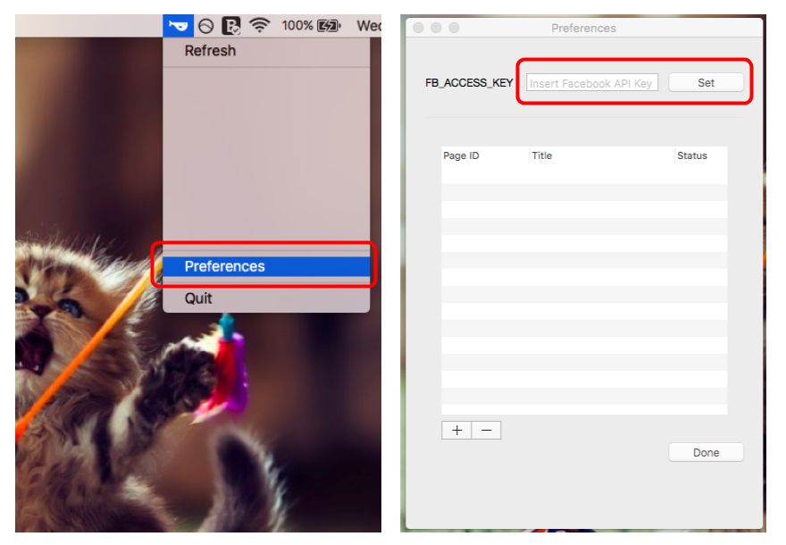
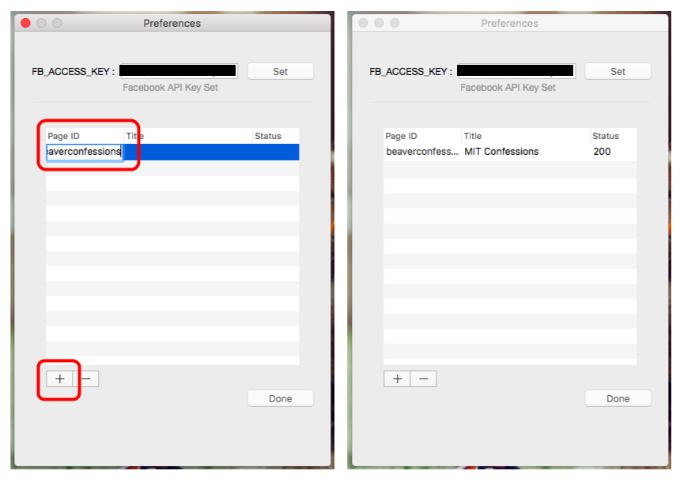

# Whale
Whale is a macOS (version 10.11.5 and later) menu bar app for getting updates on your favorite Facebook pages.

## Installation
<!-- Not done yet -->

## Usage
First, obtain a Facebook Graph API Access Key. Then open the Preferences pane, enter the key and click `Set`.

To add a new Facebook page, click on the '+' option. Then, enter the Page ID and press `Enter`.

If the page link is https://www.facebook.com/beaverconfessions/, then the page ID is `beaverconfessions`.

If successful, the pagea name will be shown in the 'Title' column with a status code of 200. If an error occurred, refer to the 'Status' column for more information. 

To remove a Facebook page, select row, then click on '-' option. If no row is selected, the last row will automatically be removed.

Finally, click `Done` to save changes and exit the Preferences pane. <i>Closing the pane via the red button discards any changes.</i>

Click on 'Refresh' to fetch the latest updates from stored Facebook pages. The updates include total number of page likes, the number of posts in the last 24 hours, and when (hours ago) most recent posts were published.

## Obtaining A Facebook API Access Key

1. Go to https://developers.facebook.com/ and select My Apps > Add a New App.

2. Enter a display name for the app and an email address. Click on 'Create App ID'.

3. Select 'Dashboard'.

4. Take notes of the 'App ID' and 'App Secret'.

5. Type https://graph.facebook.com/oauth/access_token?client_id={YOUR_APP_ID}&client_secret={YOUR_APP_SECRET}&grant_type=client_credentials into a browser's address bar, replacing {YOUR_APP_ID} and {YOUR_APP_SECRET} with keys from step 4. It will display the Facebook API access key.
